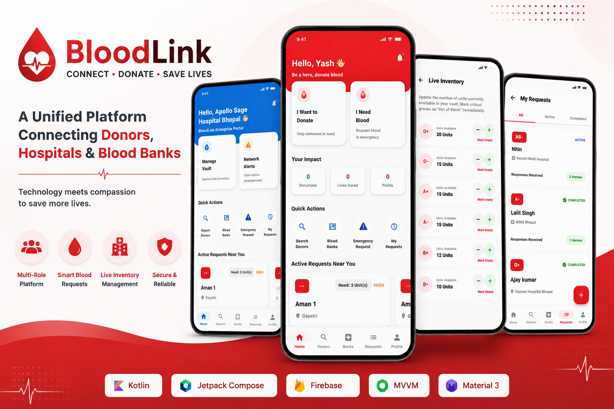
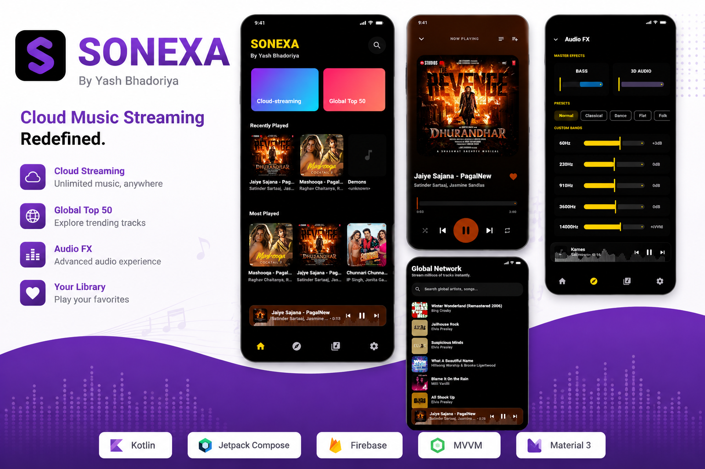
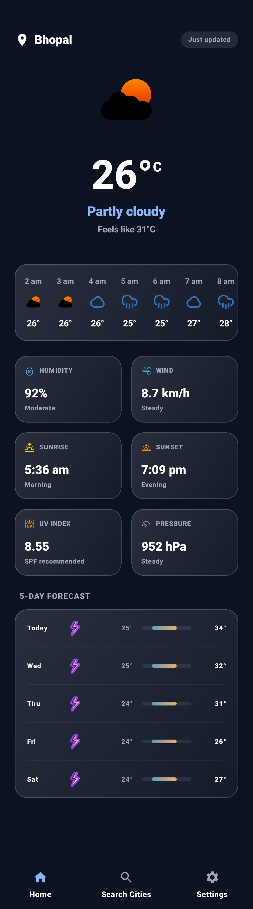
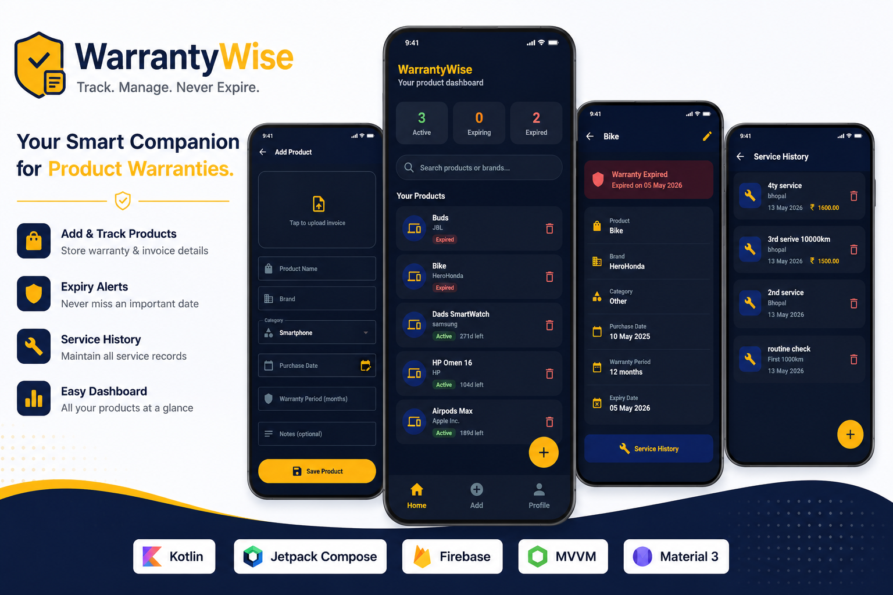

# Hi, I'm **Yash Bhadoriya** 👋

### Android Developer • Kotlin Enthusiast • Problem Solver • Software Engineer

Building scalable Android applications with modern architecture, clean code principles, and exceptional user experiences.

---

<table>

<tr>

<td width="18%" align="center">

</td>

<td width="47%">

## 👨‍💻 About Me

I'm an Information Technology undergraduate at **Jabalpur Engineering College (JEC)** with a strong passion for Android application development.

I enjoy transforming real-world problems into intuitive mobile experiences using **Kotlin**, **Jetpack Compose**, **MVVM**, and modern Android development practices.

Currently focused on building scalable applications with clean architecture, cloud integration, and thoughtful user experiences while continuously improving my knowledge of backend development and system design.

 

**Currently Exploring**

- ⚡ Backend Development with Python & FastAPI
- 🏗 System Design
- ☁ Cloud Architecture
- 🤖 Generative AI
- 📱 Advanced Android Engineering

</td>

<td width="15%" align="center">

## 📊 Stats

**20+**

Projects

 

**500+**

DSA Problems

 

**3+**

Years Coding

 

**10+**

Technologies

</td>

<td width="20%">

## 🤝 Connect

📧 **Email**

your-email@example.com

 

💼 **LinkedIn**

linkedin.com/in/yourprofile

 

💻 **GitHub**

github.com/devilyash10

 

📍 **Location**

Madhya Pradesh, India 🇮🇳

</td>

</tr>

</table>

---

### ⚡ Core Technologies

---

<!-- ========================================================== -->
<!--                     TECH STACK RIBBON                       -->
<!-- ========================================================== -->

##  Tech Stack

 

---

<!-- ========================================================== -->
<!--                  CURRENTLY BUILDING                        -->
<!-- ========================================================== -->

# 🚧 Currently Building

<table>

<tr>

<td width="18%" align="center">

 

# ❤️

### BloodLink

**Healthcare Platform**

 

🚀 **MVP Development**

</td>

<td width="42%">

## 🩸 BloodLink

### Digital Healthcare Platform

Connecting **Blood Donors**, **Hospitals**, and **Blood Banks**
through a unified Android ecosystem.

BloodLink is my flagship Android project focused on improving
blood donation management through role-based workflows,
Firebase cloud integration, and modern Android architecture.

Current implementation includes:

- Multi-role Authentication
- Blood Request Management
- Hospital Dashboard
- Blood Bank Inventory
- Firebase Cloud Backend
- Google Authentication
- MVVM + Clean Architecture

</td>

<td width="15%" align="center">

## 📈 Progress

### 70%

███████░░░

**MVP Development**

</td>

<td width="25%" align="center">

  

 

</td>

</tr>

</table>

---

<!-- ========================================================== -->
<!--                  FEATURED PROJECTS                         -->
<!-- ========================================================== -->

# ⭐ Featured Projects

*Applications engineered with modern Android technologies, scalable architecture, and a strong focus on user experience.*

 

<table>

<tr>

<td width="33%" valign="top">

 

## 🎵 Sonexa

Modern Android music streaming experience built using **Jetpack Compose**, **Media3 ExoPlayer**, and **MVVM Clean Architecture**.

### Tech

`Kotlin` `Compose` `Media3`

`Retrofit` `Room` `AudioFX`

 

 

</td>

<td width="33%" valign="top">

 

## 🌦 AtmosLive

Offline-first weather platform featuring local caching, widgets, background updates, and modern Material 3 design.

### Tech

`Kotlin`

`Compose`

`Room`

`Retrofit`

`WorkManager`

`Hilt`

 

 

</td>

<td width="33%" valign="top">

 

## 📦 WarrantyWise

Smart warranty management platform for securely organizing warranties, invoices, and service history.

### Tech

`Kotlin`

`Compose`

`Firebase`

`MVVM`

`Material 3`

`Hilt`

 

 

</td>

</tr>

</table>

---
<!-- ========================================================== -->
<!--                     OTHER PROJECTS                         -->
<!-- ========================================================== -->

# 📂 Other Projects

*A collection of applications built while exploring Android development, desktop software, cloud integration, and problem solving.*

 

<table>

<tr>

<td width="50%" valign="top">

## 🌱 Carbon Tracker

**Smart India Hackathon 2024 Project**

A sustainability-focused platform designed to encourage users to monitor and reduce their carbon footprint through data-driven insights.

**Highlights**

- 🌍 Environmental Impact Tracking
- 📊 Analytics Dashboard
- 📈 Carbon Usage Monitoring

**Tech**

`Android` `Firebase` `Java`

---

## 🖥 Quiz Desktop Application

Desktop-based quiz management software developed using Python.

**Highlights**

- Student & Admin Modes
- Dynamic Question Management
- MySQL Integration
- Performance Tracking

**Tech**

`Python`

`Tkinter`

`MySQL`

</td>

<td width="50%" valign="top">

## 📝 Notes Application

Cloud-enabled Android notes application focused on secure note management and synchronization.

**Highlights**

- Cloud Synchronization
- Local Storage
- Modern UI
- Material Design

**Tech**

`Kotlin`

`Firebase`

`Room`

---

## 🔬 Experimental Projects

A collection of smaller applications and engineering experiments used to explore Android APIs and modern development practices.

Examples include

- Firebase Authentication
- REST API Integration
- Jetpack Compose Components
- Material Design UI Experiments
- State Management Samples

</td>

</tr>

</table>

---

### 📚 More projects are available in my repositories.

---

