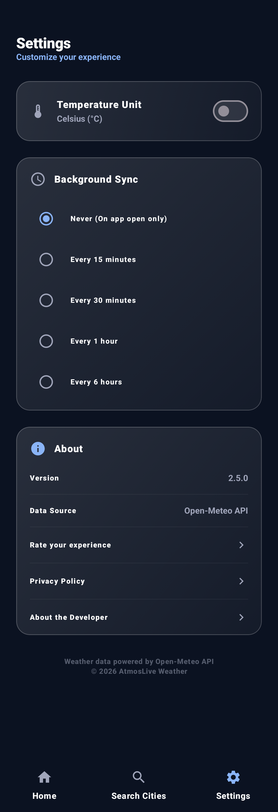

<!-- ========================================================== -->
<!--                        ATMOSLIVE                           -->
<!-- ========================================================== -->

<div align="center">

# 🌦 AtmosLive

### *A Modern Android Weather Application*

**Delivering accurate weather forecasts through a clean, responsive interface powered by modern Android architecture and real-time weather services.**

<br>


<br><br>


</div>

---

<p align="center">

<a href="#-project-highlights">

</a>

<a href="#-user-interface">

</a>

<a href="#-architecture-overview">

</a>

<a href="#-feature-showcase">

</a>

<a href="#-explore-technical-documentation">

</a>

</p>

---

# 📖 Executive Summary

AtmosLive is a modern Android weather application built to deliver real-time weather information through a fast, intuitive, and visually appealing user experience.

Developed using **Jetpack Compose**, **MVVM**, **Kotlin Coroutines**, **StateFlow**, **Retrofit**, and the **OpenWeather API**, the application retrieves live weather data, hourly forecasts, and multi-day predictions while maintaining a clean architecture and responsive interface.

Beyond displaying weather information, AtmosLive demonstrates modern Android development practices, reactive state management, API integration, and scalable application design for real-world mobile experiences.

---

# 🎯 Why AtmosLive?

Weather applications are among the most frequently used mobile utilities, requiring reliable data, responsive interfaces, and efficient network communication.

AtmosLive was developed to explore how modern Android technologies can be combined to build a production-oriented weather application that balances performance, usability, and maintainability.

The project emphasizes clean architecture, reactive programming, and thoughtful UI design while providing accurate weather information through real-time API integration.

---

# ✨ Project Highlights

<table>

<tr>

<td width="50%">

### 🌦 Weather Experience

- Real-Time Weather Updates
- Hourly Forecast
- 7-Day Forecast
- Dynamic Weather Icons
- Current Location Support
- Automatic Refresh

</td>

<td width="50%">

### ⚙ Engineering

- Jetpack Compose
- MVVM Architecture
- Repository Pattern
- Kotlin Coroutines
- StateFlow
- Retrofit API
- Material Design 3
- Responsive UI

</td>

</tr>

</table>

---

# 📱 User Interface

AtmosLive follows **Material Design 3** principles with a clean and distraction-free interface designed around readability and quick access to weather information.

The application presents current conditions, hourly forecasts, and weekly predictions through responsive layouts, dynamic weather illustrations, and adaptive color palettes that reflect changing weather conditions.

<p align="center">




</p>

The interface prioritizes clarity, ensuring essential weather information is available at a glance while maintaining a modern and visually engaging design.

---

# 🏗 Architecture Overview

AtmosLive follows **MVVM (Model–View–ViewModel)** and **Clean Architecture**, separating presentation, business logic, and network communication into independent layers.

By isolating API communication from the user interface, the application remains maintainable, testable, and ready for future feature expansion.

<div align="center">

```text
                 🌦 AtmosLive

        ┌─────────────────────────┐
        │   Jetpack Compose UI    │
        └────────────┬────────────┘
                     │
              ViewModels (MVVM)
                     │
             Repository Pattern
                     │
      ┌──────────────┼──────────────┐
      ▼              ▼              ▼
 Retrofit API   OpenWeather API   StateFlow
                     │
              Live Weather Data
```

</div>

Application state is managed using **StateFlow** and **Kotlin Coroutines**, allowing weather information to update reactively while keeping the interface responsive and lifecycle-aware.

---

# ⚙ Technology Stack

| Category | Technology |
|-----------|------------|
| **Language** | Kotlin |
| **UI Framework** | Jetpack Compose |
| **Architecture** | MVVM + Repository Pattern |
| **Networking** | Retrofit + OkHttp |
| **Weather API** | OpenWeather API |
| **State Management** | StateFlow + Coroutines |
| **Dependency Injection** | Hilt |
| **Location Services** | Fused Location Provider |
| **Design System** | Material Design 3 |

---

# 🚀 Engineering Highlights

<table>

<tr>

<td width="50%">

### 🌍 Weather Services

- OpenWeather API
- Current Weather
- Hourly Forecast
- Multi-Day Forecast
- Location Detection
- Real-Time Updates

</td>

<td width="50%">

### ⚡ Android Engineering

- Jetpack Compose
- MVVM Architecture
- Repository Pattern
- Kotlin Coroutines
- StateFlow
- Responsive UI

</td>

</tr>

</table>

---

# 📊 Technical Metrics

| Metric | Result |
|---------|--------|
| 🌍 Weather Source | OpenWeather API |
| ⚡ Data Updates | Real-Time API Requests |
| 📱 UI Framework | Jetpack Compose |
| 🏗 Architecture | MVVM + Repository Pattern |
| 📍 Location Support | GPS + Search |
| 🔄 Reactive State | Kotlin StateFlow |

---

# ✨ Feature Showcase

<details open>
<summary><b>🌦 Real-Time Weather</b></summary>

<br>

- Live weather conditions
- Temperature, humidity, pressure, and wind information
- Weather condition descriptions with dynamic icons
- Automatic weather refresh
- Accurate location-based forecasts

</details>

<details>
<summary><b>📅 Forecasting</b></summary>

<br>

- Hourly weather forecast
- Multi-day weather forecast
- Sunrise & Sunset timings
- Daily high & low temperatures
- Weather trend visualization

</details>

<details>
<summary><b>📍 Location Services</b></summary>

<br>

- Automatic GPS location detection
- Search weather by city
- Current location weather
- Fast location switching
- Reliable location updates

</details>

<details>
<summary><b>🎨 User Experience</b></summary>

<br>

Designed using Material Design 3 to deliver a clean and modern weather experience.

- Dynamic weather illustrations
- Responsive layouts
- Smooth animations
- Intuitive navigation
- Light & Dark Theme
- Optimized Compose UI

</details>

---

# 🧠 Engineering Challenges

Building AtmosLive involved more than displaying weather information. The project required balancing responsive UI, asynchronous networking, and reliable location services while maintaining a clean application architecture.

### 🌍 API Integration

Integrating the OpenWeather API required handling asynchronous network requests, parsing weather data, and presenting results in a user-friendly format while maintaining application responsiveness.

---

### 📍 Location Management

Supporting both automatic GPS detection and manual city search required careful coordination between Android location services and remote weather APIs.

---

### 🔄 Reactive UI

Weather information changes dynamically based on user location and API responses. StateFlow was used to keep the interface synchronized without requiring manual refresh logic.

---

### ⚡ Performance & Reliability

The application was designed to minimize unnecessary API calls while providing smooth animations, quick response times, and efficient state management.

---

# 📚 Key Learnings

AtmosLive strengthened my understanding of modern Android application development through practical implementation of networking, architecture, and reactive programming.

During development I gained experience in:

- Building REST API driven Android applications.
- Implementing MVVM with Repository Pattern.
- Managing asynchronous operations using Kotlin Coroutines.
- Creating reactive interfaces using StateFlow.
- Integrating Retrofit with external APIs.
- Working with Android location services.
- Designing responsive Jetpack Compose interfaces.
- Structuring maintainable Android projects.

The project reinforced the importance of clean architecture, separation of concerns, and user-focused interface design when building production-ready Android applications.

---

# 🚀 Future Roadmap

The current implementation establishes a strong foundation, with several enhancements planned for future releases.

| Status | Planned Feature |
|:------:|-----------------|
| 🚧 | Weather Alerts & Notifications |
| 🚧 | Air Quality Index (AQI) |
| 🚧 | Interactive Weather Maps |
| 🚧 | Widgets for Home Screen |
| 🚧 | Weather Radar |
| 🚧 | Multiple Saved Locations |
| 🚧 | Weather History |
| 🚧 | Wear OS Support |

Future development will continue focusing on improving accuracy, user experience, and application performance while maintaining a clean and scalable architecture.

---

# 📚 Explore Technical Documentation

This page provides a high-level overview of AtmosLive.

For a deeper understanding of the application's architecture and implementation, explore the detailed technical documentation.

| 📖 Document | Description |
|-------------|-------------|
| [Overview](./atmoslive/OVERVIEW.md) | Project overview and repository guide |
| [Features](./atmoslive/FEATURES.md) | Complete feature reference |
| [Architecture](./atmoslive/ARCHITECTURE.md) | System architecture and design |
| [Implementation](./atmoslive/IMPLEMENTATION.md) | Runtime workflows and implementation |
| [Engineering Decisions](./atmoslive/DECISIONS.md) | Technology choices and design rationale |
| [Roadmap](./atmoslive/ROADMAP.md) | Planned development and future milestones |

> **Interested in the engineering behind AtmosLive?**  
> Explore the documents above for a detailed breakdown of the application's architecture, implementation, and future direction.

---

# 📸 Project Gallery

A glimpse into the current implementation of AtmosLive.

<p align="center">


</p>

Additional screenshots and UI walkthroughs are available throughout the repository documentation.

---

# 💭 Final Thoughts

AtmosLive demonstrates how modern Android technologies can be combined to build a responsive, scalable, and user-friendly weather application.

By integrating Jetpack Compose, MVVM, Retrofit, and reactive state management, the project delivers real-time weather information through a clean architecture designed for future growth.

As development continues, AtmosLive will evolve with additional weather intelligence and personalization features while maintaining the engineering principles established throughout the project.

---

<div align="center">

### ⭐ Thank you for exploring AtmosLive!

If you found this project interesting, consider exploring the technical documentation or starring the repository.

<br>

<a href="https://github.com/devilyash10/AtmosLive_dynamic_weather_app">

</a>

&nbsp;

<a href="./atmoslive/OVERVIEW.md">

</a>

</div>