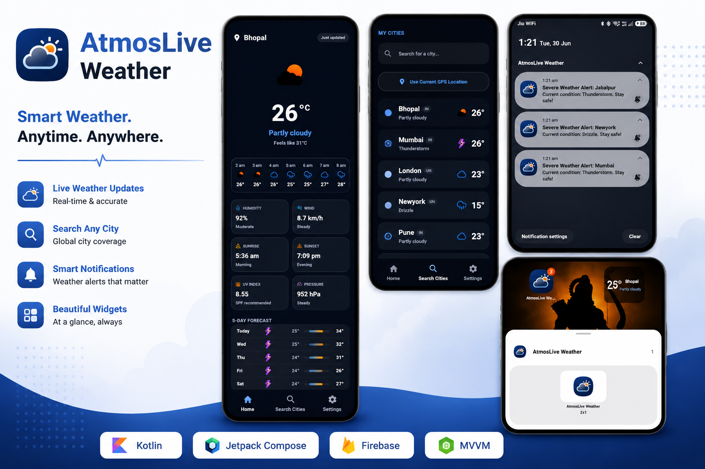
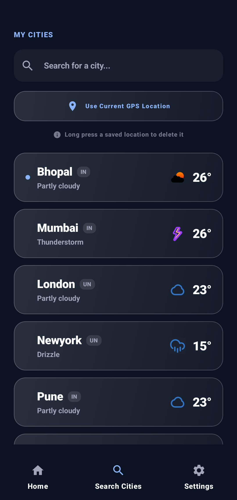
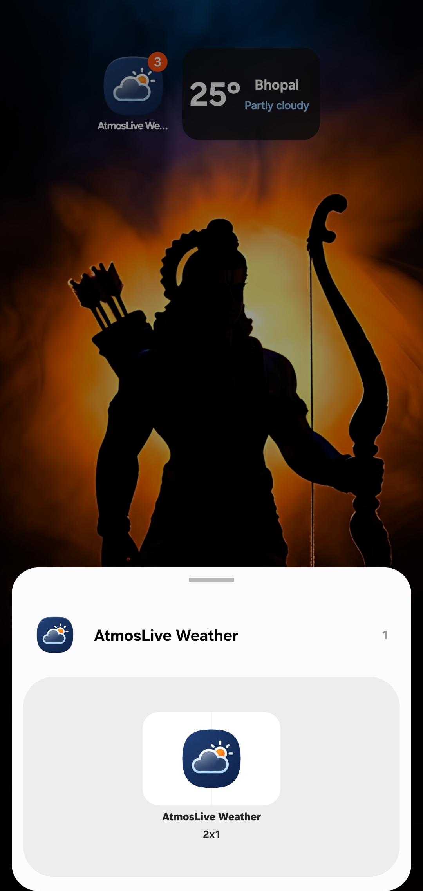
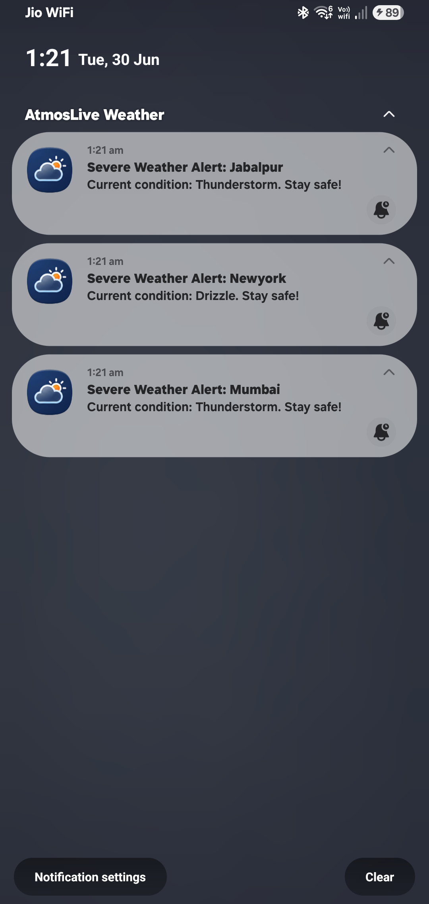

<!-- ========================================================= -->
<!--                       AtmosLive                           -->
<!-- ========================================================= -->

<p align="center">
  
</p>

<h1 align="center">AtmosLive Weather</h1>

<p align="center">
A modern Android weather application engineered with an <strong>offline-first architecture</strong>, built using Kotlin, Jetpack Compose, and Material 3.
</p>

<p align="center">

<a href="https://github.com/devilyash10/dynamic_weather_app">

</a>


</p>

---

# Overview

AtmosLive is a native Android weather application focused on delivering a fast, reliable, and visually refined weather experience.

Unlike conventional weather applications that rely entirely on network availability, AtmosLive follows an **offline-first** approach. Previously retrieved weather information is immediately presented to the user while background synchronization updates forecasts silently, minimizing perceived loading time and reducing unnecessary network traffic.

The application combines modern Android development practices with a scalable architecture, enabling responsive user interfaces, reliable background execution, and maintainable code as the project continues to evolve.

---

# Screenshots

<p align="center">








</p>

---

# Key Features

- Offline-first weather rendering
- Live weather forecasts powered by Open-Meteo
- Automatic GPS location detection
- Smart city search with local persistence
- Jetpack Glance home screen widget
- Configurable background synchronization
- Severe weather notifications
- Dynamic Celsius/Fahrenheit conversion
- Material 3 interface with custom glassmorphism
- Battery-aware background execution using WorkManager

For a detailed explanation of every capability, see **[FEATURES.md](FEATURES.md)**.

---

# Technology Stack

| Category | Technologies |
|-----------|--------------|
| Language | Kotlin |
| UI | Jetpack Compose, Material 3 |
| Architecture | MVVM, Clean Architecture |
| Dependency Injection | Dagger Hilt |
| Networking | Retrofit, Gson |
| Background Tasks | WorkManager |
| Local Storage | Room Database, DataStore |
| Navigation | Navigation Compose |
| Location | FusedLocationProviderClient |
| Widgets | Jetpack Glance |
| Concurrency | Kotlin Coroutines, StateFlow |

---

# Architecture Overview

AtmosLive follows a layered architecture inspired by Clean Architecture principles.

```
Presentation
     │
     ▼
 ViewModel
     │
     ▼
 Repository
     │
 ┌───┴───────────────┐
 ▼                   ▼
Remote API      Local Database
(Open-Meteo)        (Room)
```

Application state is exposed through **StateFlow**, ensuring predictable, lifecycle-aware updates while maintaining a single source of truth for the user interface.

A complete architectural breakdown is available in **[ARCHITECTURE.md](ARCHITECTURE.md)**.

---

# Project Structure

```text
app/
│
├── data/
│   ├── remote/
│   ├── local/
│   ├── repository/
│   └── mapper/
│
├── domain/
│   ├── model/
│   ├── repository/
│   └── location/
│
├── presentation/
│   ├── home/
│   ├── search/
│   ├── settings/
│   ├── widget/
│   └── common/
│
├── di/
├── worker/
└── ui/
```

The project structure emphasizes separation of concerns, allowing each layer to evolve independently while remaining easy to test and maintain.

---

# Documentation

Project documentation is organized into focused guides.

| Document | Description |
|----------|-------------|
| [FEATURES.md](FEATURES.md) | Complete feature reference |
| [ARCHITECTURE.md](ARCHITECTURE.md) | System architecture and design decisions |
| [IMPLEMENTATION.md](IMPLEMENTATION.md) | Internal implementation details |
| [ROADMAP.md](ROADMAP.md) | Development roadmap and future plans |
| [DECISIONS.md](DECISIONS.md) | Engineering decisions and technology choices |

---

# Getting Started

```bash
git clone https://github.com/devilyash10/dynamic_weather_app.git
```

Open the project in Android Studio.

Configure your preferred weather API endpoint if required.

Sync Gradle.

Run the application on an Android device running Android 10 (API 29) or above.

---

# Development Status

Current Release

```
Stable v2.5.0
```

Highlights of the latest release include:

- Jetpack Glance widget
- Background synchronization
- Persistent DataStore preferences
- Improved navigation animations
- Material 3 UI refinements
- Premium empty states
- Privacy policy onboarding
- Performance optimizations

For future milestones, see **[ROADMAP.md](ROADMAP.md)**.

---

# License

This project is released under the custom license included in this repository.

See the [LICENSE](../../LICENSE) file for details.

---

# Author

**Yash Bhadoriya**

Android Developer

GitHub: https://github.com/devilyash10

LinkedIn: https://www.linkedin.com/in/yashbhadoriya881


---

<p align="center">

Designed and developed with ❤️ using Kotlin, Jetpack Compose, and modern Android engineering practices.

</p>