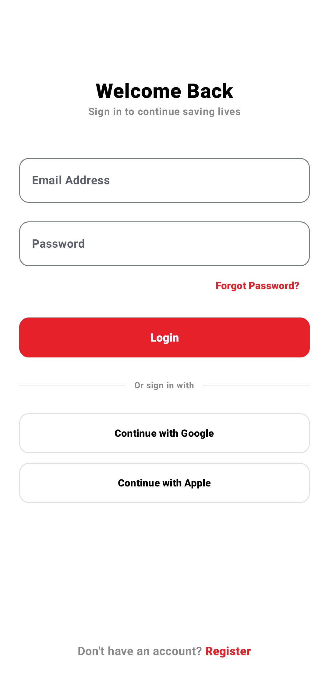
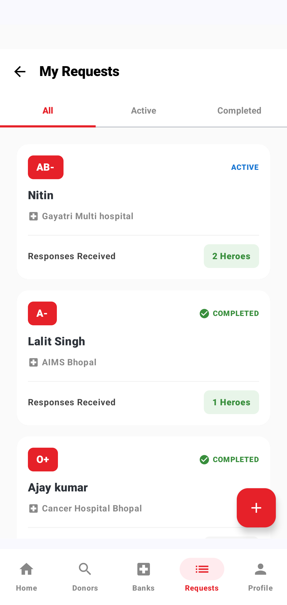

<!-- ========================================================== -->
<!--                        BLOODLINK                           -->
<!-- ========================================================== -->

<div align="center">

# 🩸 BloodLink

### *A Modern Healthcare Coordination Platform*

**Connecting blood donors, hospitals, and blood banks through a unified Android ecosystem powered by modern cloud technologies.**

<br>


<br><br>


</div>

---

<p align="center">

<a href="#-project-highlights">

</a>

<a href="#-platform-overview">

</a>

<a href="#-system-architecture">

</a>

<a href="#-project-gallery">

</a>

<a href="#-explore-technical-documentation">

</a>

</p>

---

# 📖 Executive Summary

BloodLink is a healthcare-focused Android application designed to simplify emergency blood donation by connecting donors, hospitals, and blood banks through a single digital platform.

Built using **Jetpack Compose**, **Firebase**, **MVVM**, **Hilt**, **StateFlow**, and **Material Design 3**, the application enables secure authentication, real-time request management, cloud synchronization, and role-based workflows tailored to different healthcare participants.

Rather than functioning as a simple blood donor directory, BloodLink demonstrates how modern Android architecture can support scalable healthcare coordination through responsive interfaces, cloud-native services, and production-oriented engineering practices.


# ❤️ Why BloodLink?

Emergency blood donation often depends on fragmented communication, manual coordination, and delayed information sharing between donors, hospitals, and blood banks.

BloodLink was created to explore how modern Android technologies can improve this process by bringing every stakeholder into a unified digital ecosystem.

The platform focuses on reducing coordination delays, improving accessibility, and establishing a scalable foundation for real-time healthcare collaboration.

---

# ✨ Project Highlights

<table>

<tr>

<td width="50%">

### 🩸 Multi-Role Platform

- Blood Donor Portal
- Hospital Portal
- Blood Bank Portal
- Role-Based Navigation
- Secure Authentication
- Cloud Synchronization

</td>

<td width="50%">

### ⚙ Engineering

- Jetpack Compose
- MVVM Architecture
- Hilt DI
- Firebase Services
- StateFlow
- Repository Pattern

</td>

</tr>

</table>


---

# 🎯 Vision

BloodLink is being developed with one fundamental goal:

> **To reduce the time between a blood request and a successful donation by improving communication, accessibility, and coordination through technology.**

Every design decision—from authentication and user roles to cloud synchronization and inventory management—is driven by that objective.

---
# 🏥 Platform Overview

Unlike conventional blood donation applications that primarily connect donors with recipients, BloodLink is designed as a **multi-role healthcare platform** where every stakeholder operates through a dedicated workspace while sharing the same secure cloud infrastructure.

Each role has its own responsibilities, workflows, and interface, ensuring users interact only with the tools relevant to them while collaborating through a unified ecosystem.

<div align="center">

```text
                    🩸 BloodLink Platform

                      ☁ Firebase Cloud

                              │
        ┌─────────────────────┼─────────────────────┐
        │                     │                     │
        ▼                     ▼                     ▼

   🩸 Blood Donor        🏥 Hospital          🏦 Blood Bank

 • Donate Blood       • Create Requests    • Manage Inventory
 • Browse Requests    • Track Requests     • Update Stock
 • Donation History   • Monitor Patients   • Respond to Requests
 • Nearby Hospitals   • Coordinate Donors  • Availability Status
 • Profile            • Dashboard          • Institution Profile
```

</div>

This role-driven approach keeps each workflow focused while allowing hospitals, blood banks, and donors to collaborate through real-time cloud synchronization.

---

# ✨ Core Platform Capabilities

<table>

<tr>

<td width="50%">

### 👤 User Experience

- Secure Authentication
- Google Sign-In
- Role-Based Navigation
- Responsive Material 3 UI
- Profile Management
- Cloud Synchronization

</td>

<td width="50%">

### 🏥 Healthcare Workflows

- Emergency Blood Requests
- Blood Inventory Management
- Hospital Coordination
- Donor Discovery
- Request Tracking
- Institution Management

</td>

</tr>

</table>

---

# 📱 User Experience

BloodLink follows **Material Design 3** principles to provide a clean, accessible, and consistent experience across all user roles.

Whether users are creating an emergency blood request, updating inventory, or responding as a donor, the interface remains intuitive while minimizing unnecessary interactions during time-sensitive situations.

<p align="center">






</p>

The interface has been designed with a consistent visual language across donor, hospital, and blood bank workflows to reduce the learning curve while maintaining a professional healthcare-focused experience.

---

# 💡 Engineering Objectives

BloodLink is much more than an Android CRUD application.

The project was intentionally designed to explore several real-world software engineering challenges:

- Designing a scalable multi-role authentication system.
- Managing independent user workflows within a shared cloud database.
- Building reusable UI components using Jetpack Compose.
- Maintaining a reactive application architecture using MVVM and StateFlow.
- Synchronizing cloud data securely with Firebase Firestore.
- Creating an interface that remains simple despite handling complex healthcare workflows.
- Building a codebase that can evolve as additional modules and services are introduced.

Throughout development, the emphasis has remained on maintainability, scalability, and long-term extensibility rather than simply implementing features.

---
---

# 🏗 Architecture Overview

BloodLink follows a **role-driven MVVM architecture** designed to support multiple healthcare stakeholders within a single Android application.

Instead of maintaining separate applications for donors, hospitals, and blood banks, BloodLink provides independent user experiences through shared business logic, centralized cloud services, and reusable UI components.

This approach simplifies maintenance, reduces code duplication, and allows new healthcare workflows to be introduced without major architectural changes.

<div align="center">

```text
                   🩸 BloodLink

             Jetpack Compose UI
                     │
             ViewModels (MVVM)
                     │
            Repository Pattern
                     │
     ┌───────────────┼────────────────┐
     ▼               ▼                ▼
Firebase Auth   Cloud Firestore   Firebase Storage
     │               │                │
 Authentication  Real-Time Data   Profile Images
 User Roles      Blood Requests   Documents
```

</div>

Application state is managed using **StateFlow** and **Kotlin Coroutines**, ensuring the user interface remains synchronized with cloud data while maintaining a smooth and responsive experience.

---

# ⚙ Technology Stack

| Category | Technology |
|-----------|------------|
| **Language** | Kotlin |
| **UI Framework** | Jetpack Compose |
| **Architecture** | MVVM + Repository Pattern |
| **Backend** | Firebase |
| **Authentication** | Firebase Authentication |
| **Database** | Cloud Firestore |
| **Storage** | Firebase Storage |
| **State Management** | StateFlow + Coroutines |
| **Dependency Injection** | Hilt |
| **Design System** | Material Design 3 |
| **Maps & Location** | Google Maps SDK |

---

# 🚀 Engineering Highlights

<table>

<tr>

<td width="50%">

### ☁ Cloud Platform

- Firebase Authentication
- Cloud Firestore
- Firebase Storage
- Real-time Synchronization
- Secure User Management
- Cloud-based Workflows

</td>

<td width="50%">

### ⚡ Android Engineering

- Jetpack Compose
- MVVM Architecture
- Repository Pattern
- Kotlin Coroutines
- StateFlow
- Hilt Dependency Injection

</td>

</tr>

</table>

---

# 📊 Technical Highlights

| Category | Implementation |
|----------|----------------|
| 🏛 Architecture | MVVM + Repository Pattern |
| ☁ Backend | Firebase Cloud Platform |
| 🔐 Authentication | Email/Password + Google Sign-In |
| 🔄 Synchronization | Cloud Firestore |
| 📦 State Management | StateFlow |
| 🧭 Navigation | Role-Based Navigation |
| 📱 UI | Jetpack Compose + Material 3 |
| 📍 Maps | Google Maps Integration |


---

# ☁ Platform Services

BloodLink combines modern Android development with cloud-native infrastructure to provide secure authentication, real-time synchronization, and scalable healthcare workflows.

<table>

<tr>

<td width="50%">

### 🔐 Authentication

- Email & Password Sign-In
- Google Sign-In
- Secure Session Management
- Role-Based Access Control

</td>

<td width="50%">

### ☁ Cloud Platform

- Cloud Firestore
- Firebase Storage
- Real-Time Synchronization
- Secure Cloud Infrastructure

</td>

</tr>

<tr>

<td width="50%">

### 📍 Location Services

- Nearby Hospital Discovery
- Google Maps Integration
- External Navigation Support
- Location-Aware Workflows

</td>

<td width="50%">

### 🔔 Communication

- Phone Call Integration
- SMS Support
- Emergency Notifications *(Planned)*
- In-App Messaging *(Roadmap)*

</td>

</tr>

</table>

---

# 🩸 Role-Based Workflows

BloodLink delivers a personalized experience for every stakeholder while sharing the same secure backend infrastructure.

| Role | Primary Responsibilities |
|------|--------------------------|
| 🩸 **Donor** | Donate blood, manage requests, view nearby hospitals, maintain donor profile |
| 🏥 **Hospital** | Create emergency requests, monitor inventory, coordinate with donors |
| 🏦 **Blood Bank** | Manage blood stock, update availability, respond to institutional requests |

Each workflow is independently designed while remaining synchronized through Firebase Cloud Firestore.

---

# 💡 Engineering Decisions

Several architectural decisions guided the development of BloodLink.

- Single application supporting multiple healthcare roles.
- Shared cloud infrastructure with role-specific workflows.
- Reactive state management using StateFlow.
- MVVM with Repository Pattern for maintainability.
- Cloud-first synchronization through Firebase.
- Modular architecture prepared for future expansion.

These decisions allow the platform to evolve without requiring major architectural changes.

---

# ✨ Feature Showcase

<table>

<tr>

<td width="50%">

### 👤 Donor Experience

- Registration & Authentication
- Blood Donation Requests
- Donation History
- Nearby Hospitals
- Request Tracking
- Profile Management

</td>

<td width="50%">

### 🏥 Institutional Experience

- Emergency Request Management
- Blood Inventory
- Dashboard Overview
- Blood Availability
- Institution Profiles
- Operational Workflows

</td>

</tr>

</table>
---

# 🚧 Engineering Challenges

Building BloodLink involved solving challenges that extended beyond Android development and into software architecture, cloud infrastructure, and user experience design.

### 🏗 Multi-Role System Design

Designing a single application for donors, hospitals, and blood banks required independent workflows while maintaining a shared codebase. Each role has dedicated navigation, permissions, and business logic without duplicating infrastructure.

---

### ☁ Real-Time Cloud Synchronization

Maintaining consistent data across multiple users required careful Firestore data modeling and reactive state management using StateFlow and Kotlin Coroutines.

---

### ❤️ Healthcare-Focused UX

BloodLink is intended for situations where users may be under stress. The interface was designed to minimize unnecessary interactions, keeping important actions accessible within as few steps as possible.

---

### 📈 Designing for Scale

The project architecture was planned with future expansion in mind, allowing features such as push notifications, OTP authentication, in-app messaging, analytics, and advanced location services to be introduced without major architectural changes.

---

# 📚 Key Learnings

BloodLink has been my most technically challenging Android project and significantly improved my understanding of building production-oriented applications.

Through this project I gained practical experience in:

- Designing scalable Android architectures.
- Building multi-role applications.
- Structuring Cloud Firestore databases.
- Managing reactive UI with StateFlow.
- Developing reusable Jetpack Compose components.
- Applying MVVM and Repository Pattern in medium-scale projects.
- Building cloud-connected applications using Firebase services.
- Planning software with long-term maintainability in mind.

More importantly, the project reinforced that good software engineering is not only about implementing features, but also about designing systems that remain maintainable as requirements evolve.

---

# 🚀 Development Status

| Status | Progress |
|:------:|----------|
| ✅ | Multi-role Authentication |
| ✅ | Donor Portal |
| ✅ | Hospital Portal |
| ✅ | Blood Bank Portal |
| ✅ | Emergency Request Management |
| ✅ | Cloud Synchronization |
| ✅ | Inventory Management |
| ✅ | Google Maps Integration |
| 🚧 | Phone OTP Authentication |
| 🚧 | Push Notifications |
| 🚧 | Reminder System |
| 📅 | Real-Time Chat |
| 📅 | Device Geolocation |
| 📅 | Administrative Dashboard |
| 📅 | Analytics & Reporting |

---

# 📚 Explore Technical Documentation

This page provides a high-level overview of BloodLink.

For a deeper understanding of the platform's architecture, implementation, and engineering decisions, explore the complete technical documentation.

| 📖 Document | Description |
|-------------|-------------|
| [Overview](./bloodlink/OVERVIEW.md) | Project overview and repository guide |
| [Features](./bloodlink/FEATURES.md) | Complete feature reference |
| [Architecture](./bloodlink/ARCHITECTURE.md) | System architecture and design |
| [Implementation](./bloodlink/IMPLEMENTATION.md) | Runtime workflows and implementation |
| [Engineering Decisions](./bloodlink/DECISIONS.md) | Design rationale and technology choices |
| [Roadmap](./bloodlink/ROADMAP.md) | Planned development and future milestones |

> **Interested in the engineering behind BloodLink?**  
> The documents above provide a detailed breakdown of the platform's architecture, implementation, and future direction.

---

# 📸 Project Gallery

A glimpse into the current MVP implementation of BloodLink.

<p align="center">


</p>

Additional screenshots and technical walkthroughs are available throughout the repository documentation.

---

# 💭 Final Thoughts

BloodLink represents my effort to apply modern Android development practices to a real-world healthcare problem.

The project combines Jetpack Compose, Firebase, MVVM, and cloud-native architecture to create a scalable platform capable of supporting collaboration between donors, hospitals, and blood banks.

As development continues, the platform will evolve with new capabilities while preserving the architectural principles of scalability, maintainability, and user-centered design established during its initial development.

---

<div align="center">

### ⭐ Thank you for exploring BloodLink!

If you found this project interesting, consider exploring the technical documentation or starring the repository.

<br>

<a href="https://github.com/devilyash10/BloodLink_Android_App">

</a>

&nbsp;

<a href="./bloodlink/OVERVIEW.md">

</a>

</div>