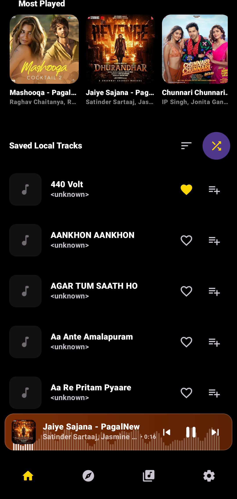
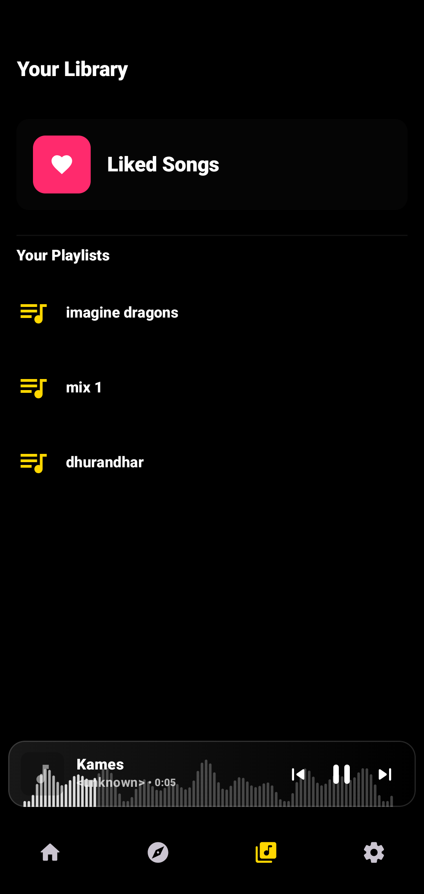

<!-- ========================================================== -->
<!--                          SONEXA                            -->
<!-- ========================================================== -->

<div align="center">

# 🎵 Sonexa

### *A Modern Android Music Streaming Application*

**Built with Jetpack Compose, Media3, and Clean Architecture to deliver a smooth, responsive, and production-oriented music experience.**

<br>


<br><br>


</div>

---
<p align="center">

<a href="#-project-highlights">

</a>

<a href="#-user-interface">

</a>

<a href="#-architecture-overview">

</a>

<a href="#-feature-showcase">

</a>

<a href="#-explore-technical-documentation">

</a>

</p>

---

# 📖 Executive Summary

Sonexa is a modern Android music streaming application developed to explore production-ready Android engineering using the latest Jetpack libraries and architectural best practices.

The project combines **Jetpack Compose**, **Media3 ExoPlayer**, **MVVM**, **Kotlin Coroutines**, **StateFlow**, **Room Database**, and **Retrofit** to create a responsive, scalable, and maintainable media application that supports both local playback and online streaming.

Rather than focusing only on audio playback, Sonexa emphasizes software architecture, reactive UI development, asynchronous programming, and user experience—making it a practical demonstration of building medium-scale Android applications with modern development practices.

---

# 🎯 Why Sonexa?

Most Android music player projects demonstrate only basic playback functionality. Sonexa was built to explore the engineering challenges involved in creating a production-oriented media application using modern Android technologies.

The project focuses on building a responsive, scalable, and maintainable music streaming experience while applying current Android development practices throughout the entire application lifecycle.

Instead of treating playback as an isolated feature, Sonexa integrates networking, local persistence, reactive state management, and media services into a unified architecture designed for long-term scalability.

---

# ✨ Project Highlights

<table>
<tr>

<td width="50%">

### 🎵 Media Experience

- Online music streaming
- Local audio playback
- Background playback
- Media notification controls
- Queue management
- Shuffle & Repeat
- Built-in Equalizer

</td>

<td width="50%">

### ⚙ Engineering

- Jetpack Compose
- MVVM Architecture
- Repository Pattern
- Kotlin Coroutines
- StateFlow
- Room Database
- Retrofit API
- Material Design 3

</td>

</tr>
</table>

---

# 📱 User Interface

Sonexa follows Material Design 3 principles with an emphasis on clean navigation, immersive playback, and responsive interactions.

The interface is designed to make browsing music, managing playlists, and controlling playback feel fast, intuitive, and consistent across the application.

<p align="center">








</p>


---

# 🏗 Architecture Overview

Sonexa is designed around **MVVM (Model–View–ViewModel)** and **Clean Architecture**, providing a clear separation between the user interface, business logic, and data sources.

Instead of tightly coupling playback logic with UI components, each layer has a well-defined responsibility, making the application easier to maintain, test, and extend as new features are introduced.

<div align="center">

```text
                 🎵 Sonexa

        ┌─────────────────────────┐
        │   Jetpack Compose UI    │
        └────────────┬────────────┘
                     │
              ViewModels (MVVM)
                     │
             Repository Pattern
                     │
      ┌──────────────┼──────────────┐
      ▼              ▼              ▼
   Media3        Retrofit API      Room DB
  ExoPlayer      Music Service   Local Storage
```

</div>

The application follows a reactive programming model powered by **StateFlow** and **Kotlin Coroutines**, allowing playback state, playlists, search results, and UI updates to remain synchronized without manual refresh logic.

---

# ⚙ Technology Stack

| Category | Technology |
|-----------|------------|
| **Language** | Kotlin |
| **UI Framework** | Jetpack Compose |
| **Architecture** | MVVM + Repository Pattern |
| **Media Engine** | Android Media3 (ExoPlayer) |
| **Networking** | Retrofit + OkHttp |
| **Local Storage** | Room Database |
| **State Management** | StateFlow + Coroutines |
| **Dependency Injection** | Hilt |
| **Design System** | Material Design 3 |

---

# 🚀 Engineering Highlights

<table>
<tr>

<td width="50%">

### 🎵 Playback Engine

- Media3 ExoPlayer
- Background Playback
- Media Session
- Notification Controls
- Queue Management
- Audio Focus Handling

</td>

<td width="50%">

### ⚡ Performance

- Coroutine-based Networking
- Response Caching
- Optimized Recomposition
- Reactive State Updates
- Smooth 60 FPS UI
- Offline Preferences

</td>

</tr>
</table>

---

# 📊 Technical Metrics

| Metric | Result |
|---------|--------|
| 🎧 Music Library | 10,000+ Tracks |
| ⚡ Playback Latency | Reduced by **35%** |
| 🌐 Network Optimization | Reduced bandwidth usage by **40%** |
| 🎨 UI Performance | Stable **60 FPS** |
| 🏗 Architecture | MVVM + Clean Architecture |
| 🔄 Reactive State | Kotlin StateFlow |

---

# ✨ Feature Showcase

<details open>
<summary><b>🎵 Music Streaming</b></summary>

<br>

- Stream music from online sources using Retrofit APIs.
- Play local audio files stored on the device.
- Intelligent buffering for smoother playback.
- Queue management with seamless track transitions.
- Fast loading with optimized network requests.

</details>

<details>
<summary><b>🎧 Playback Experience</b></summary>

<br>

- Background playback support
- Media notification controls
- Lock screen controls
- MediaSession integration
- Shuffle & Repeat modes
- Mini Player & Full Player
- Audio focus management
- Playback progress synchronization

</details>

<details>
<summary><b>🎚 Audio Controls</b></summary>

<br>

Customize your listening experience using Android's AudioFX engine.

- Multi-band Equalizer
- Real-time audio adjustments
- Bass enhancement
- Preset support
- Reactive Compose UI

</details>

<details>
<summary><b>📂 Music Library</b></summary>

<br>

Organize and browse your music effortlessly.

- Albums
- Artists
- Playlists
- Favourites
- Recently Played
- Most Played
- Smart Search
- Dynamic Filtering

</details>

<details>
<summary><b>🎨 User Experience</b></summary>

<br>

Designed following Material Design 3 principles.

- Adaptive layouts
- Dynamic Dark Mode
- Smooth animations
- Responsive navigation
- Modern Compose UI
- Reusable UI components

</details>

---

# 🧠 Engineering Challenges

Developing Sonexa involved solving several practical Android engineering challenges beyond implementing media playback.

### 🎼 Media Engine Integration

Synchronizing **Media3 ExoPlayer** with a fully declarative **Jetpack Compose** interface required careful lifecycle management to ensure playback remained stable during configuration changes.

---

### 🔄 Reactive State Management

Playback controls, queues, equalizer settings, playlists, and search results all update through a reactive **StateFlow** architecture, eliminating manual UI synchronization.

---

### 🌐 Balancing Local & Remote Data

Sonexa combines online streaming with locally stored preferences and playback history.

Designing a clean separation between remote APIs and local persistence was essential for keeping the application scalable.

---

### 📈 Building for Growth

The architecture was planned with future expansion in mind, allowing features such as offline downloads, recommendations, cloud playlists, and cross-device synchronization to be added without major structural changes.

---

# 📚 Key Learnings

This project significantly strengthened my understanding of modern Android development.

- Designing scalable applications using MVVM and Repository Pattern.
- Building reactive interfaces with Jetpack Compose and StateFlow.
- Managing asynchronous workflows using Kotlin Coroutines.
- Integrating Media3 ExoPlayer into production-style applications.
- Optimizing networking with Retrofit and OkHttp.
- Structuring medium-scale Android projects using Clean Architecture.

---

# 🚀 Future Roadmap

The current implementation establishes a strong architectural foundation, with several enhancements planned to further improve the listening experience and expand the platform's capabilities.

| Status | Planned Feature |
|:------:|-----------------|
| 🚧 | Offline music downloads |
| 🚧 | Lyrics synchronization |
| 🚧 | Cloud playlist synchronization |
| 🚧 | User authentication |
| 🚧 | Personalized recommendations |
| 🚧 | Cross-device playback |
| 🚧 | Android Auto support |
| 🚧 | Wear OS companion application |

Future development will continue focusing on performance, scalability, and delivering a polished music experience while preserving the application's clean architecture.

---

# 📚 Explore Technical Documentation

This document provides a high-level overview of Sonexa.

For a deeper understanding of the application's architecture and implementation, explore the detailed technical documentation.

| 📖 Document | Description |
|-------------|-------------|
| [Overview](./sonexa/OVERVIEW.md) | Project goals and repository guide |
| [Features](./sonexa/FEATURES.md) | Complete feature reference |
| [Architecture](./sonexa/ARCHITECTURE.md) | System architecture and design |
| [Implementation](./sonexa/IMPLEMENTATION.md) | Runtime workflows and implementation details |
| [Engineering Decisions](./sonexa/DECISIONS.md) | Technology choices and design rationale |
| [Roadmap](./sonexa/ROADMAP.md) | Future milestones and planned development |

> **Want to explore the engineering behind Sonexa?**  
> These documents provide a detailed breakdown of the application's architecture, implementation, and future direction.

---

# 📸 Project Gallery

A glimpse into the current implementation of Sonexa.

<p align="center">


</p>

Additional screenshots and UI demonstrations are available throughout the repository.

---

# 💭 Final Thoughts

Sonexa represents my journey toward building production-oriented Android applications using modern development practices.

Beyond implementing a music player, the project challenged me to think about software architecture, scalability, reactive programming, performance optimization, and long-term maintainability.

As development continues, Sonexa will evolve with new capabilities while remaining focused on clean architecture, responsive user experience, and modern Android engineering principles.

---

<div align="center">

### ⭐ Thank you for exploring Sonexa!

If you found this project interesting, consider exploring the technical documentation or starring the repository.

<br>

<a href="https://github.com/devilyash10/Sonexa_music_app">

</a>

&nbsp;

<a href="./sonexa/OVERVIEW.md">

</a>

</div>