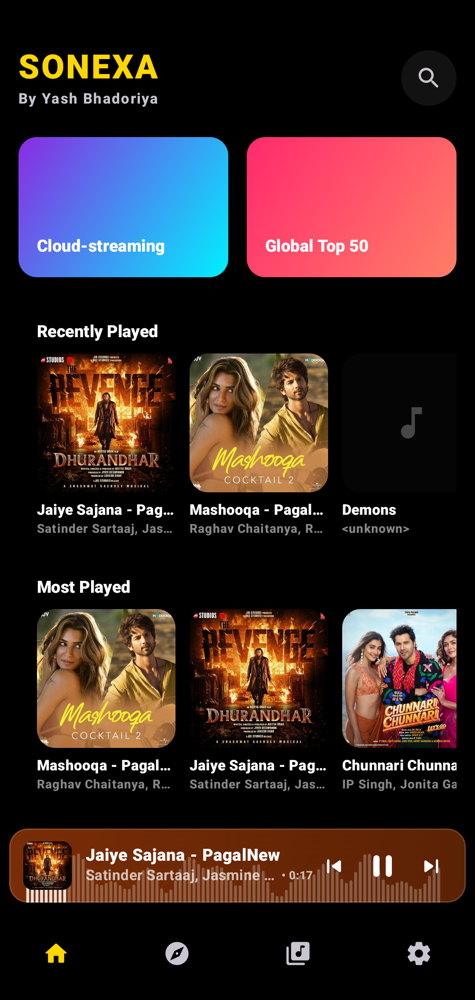
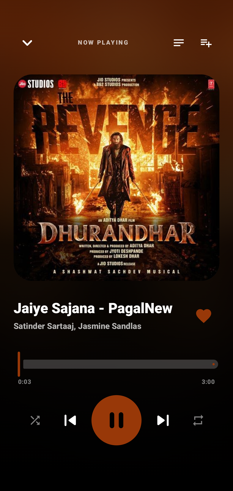
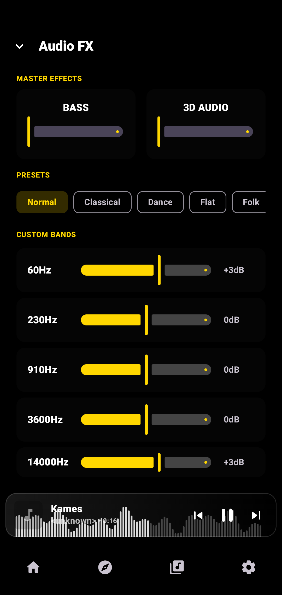
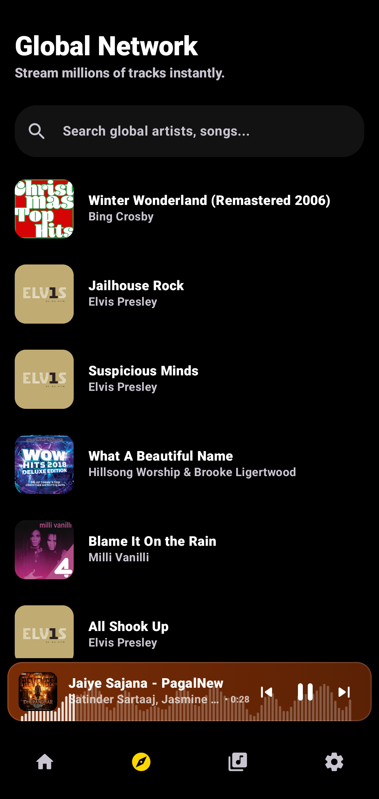

<!-- ========================================================= -->
<!--                          Sonexa                           -->
<!-- ========================================================= -->

<p align="center">
    
</p>

<h1 align="center">Sonexa Music Player</h1>

<p align="center">
A modern Android music player engineered with Jetpack Compose, Media3 (ExoPlayer), and a reactive MVVM architecture, delivering seamless offline playback, cloud-ready streaming, hardware AudioFX integration, and a premium Material 3 user experience.
</p>

<p align="center">

<a href="https://github.com/devilyash10/Sonexa_music_app">

</a>


</p>

---

# Overview

Sonexa is a native Android music player designed to provide a premium listening experience through modern Android engineering practices. Built entirely with Kotlin and Jetpack Compose, the application combines local media playback, cloud-ready streaming architecture, reactive state management, and hardware audio processing into a cohesive platform.

Unlike traditional music players that tightly couple playback with the user interface, Sonexa separates the audio engine from the presentation layer through a persistent `MediaSessionService`. This architecture allows playback to continue seamlessly while the application is minimized, the device rotates, or the user interacts with external media controls.

The project emphasizes scalability, responsiveness, and maintainability, making it suitable for future expansion into cloud streaming, cross-device synchronization, Android Auto, and Wear OS.

---

# Screenshots

<p align="center">









</p>

---

# Core Features

- Local music playback powered by Media3 ExoPlayer
- Foreground MediaSessionService for uninterrupted playback
- Dynamic Palette API based theming
- Native AudioFX equalizer with Bass Boost and Virtualizer
- Intelligent playlist and favorites management
- Recently Played and Most Played tracking
- Material 3 glassmorphism interface
- Animated MiniPlayer and Player transitions
- MediaStore based music scanner
- Cloud-ready streaming architecture
- Lyrics engine with synchronized scrolling
- AMOLED optimized dark theme
- Haptic feedback integration

A complete feature reference is available in **[FEATURES.md](FEATURES.md)**.

---

# Technology Stack

| Category | Technologies |
|-----------|--------------|
| Language | Kotlin |
| UI | Jetpack Compose, Material 3 |
| Architecture | MVVM, Feature-based Architecture |
| Media Engine | Media3 ExoPlayer, MediaSession |
| Local Storage | Room Database |
| Audio Processing | AudioFX API |
| Image Loading | Coil |
| Dynamic Theming | Palette API |
| Navigation | Navigation Compose |
| Background Services | MediaSessionService |
| Concurrency | Kotlin Coroutines, StateFlow |

---

# Architecture Overview

Sonexa follows a reactive architecture where the playback engine operates independently from the user interface.

```text
Compose UI

      │

      ▼

ViewModels

      │

      ▼

AudioController

      │

      ▼

MediaBrowser

      │

      ▼

MediaSessionService

      │

      ▼

Media3 ExoPlayer
```

The user interface observes immutable StateFlow objects while playback is managed entirely by the background service.

This architecture enables uninterrupted playback, lifecycle-aware state management, and simplified feature expansion.

A complete architectural explanation is available in **[ARCHITECTURE.md](ARCHITECTURE.md)**.

---

# Project Structure

```text
core/
data/
feature/
model/
service/

Media Engine
Repositories
Compose UI
MediaSessionService
Utilities
```

The project is organized by feature rather than technical layer, improving modularity and simplifying long-term maintenance.

---

# Documentation

| Document | Description |
|----------|-------------|
| **FEATURES.md** | Complete feature reference |
| **ARCHITECTURE.md** | System architecture and playback design |
| **IMPLEMENTATION.md** | Internal playback workflows and media engine |
| **DECISIONS.md** | Engineering decisions and technology selection |
| **ROADMAP.md** | Future development milestones |

---

# Getting Started

```bash
git clone https://github.com/devilyash10/Sonexa_music_app.git
```

Open the project using Android Studio, synchronize Gradle, grant media permissions, and run the application on a device running Android 10 (API 29) or above.

---

# Development Status

**Current Version:** v3.1

Recent milestones include:

- Dynamic Palette UI
- Hardware AudioFX
- Intelligent listening history
- Playlist management
- Glassmorphism redesign
- Lyrics engine
- Adaptive launcher icons
- Splash screen improvements

---

# License

This project is distributed under the custom license included in this repository.

See the repository **LICENSE** file for details.

---

# Author

**Yash Bhadoriya**

Android Developer

GitHub: https://github.com/devilyash10

---

<p align="center">

Designed and engineered with Kotlin, Jetpack Compose, and Media3.

</p>