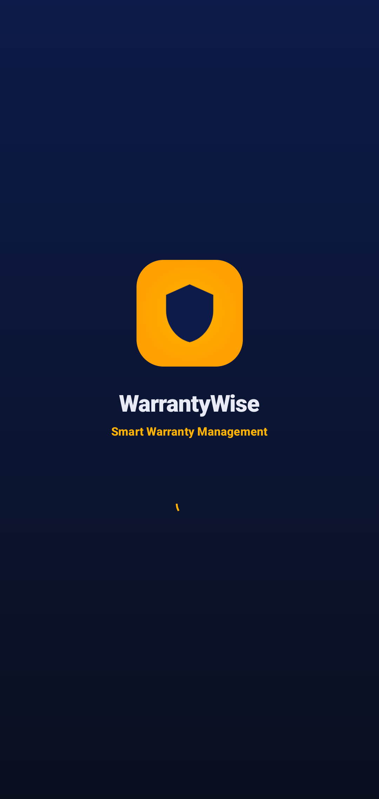
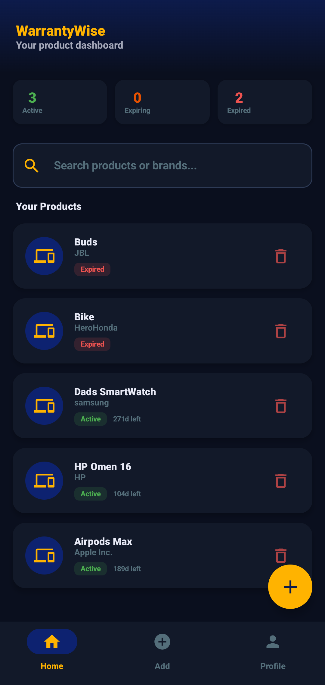
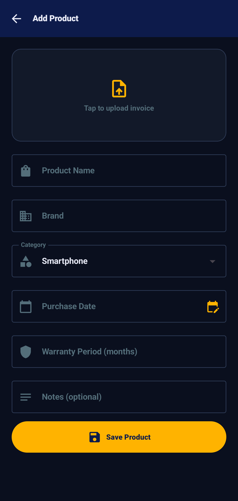
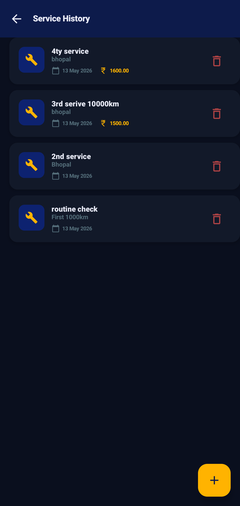
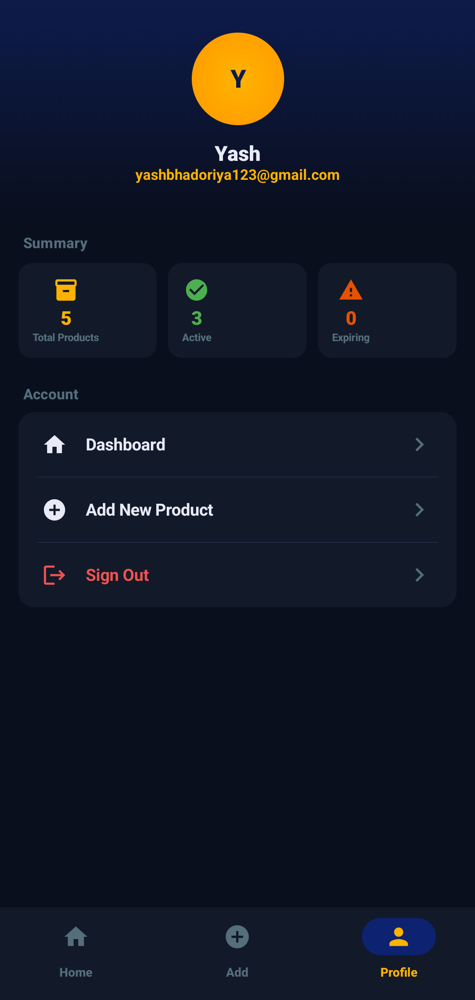
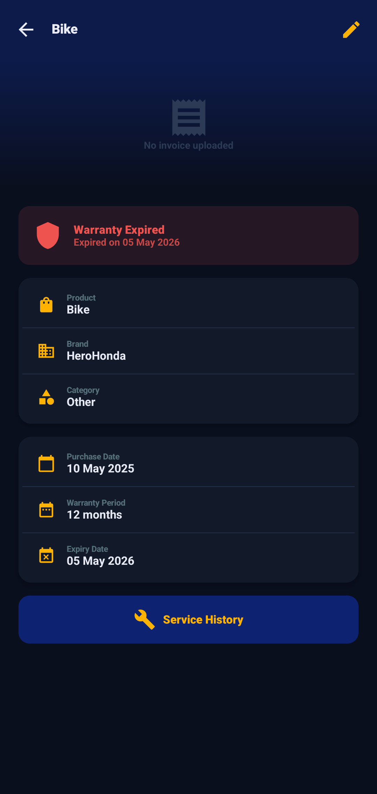

<!-- ========================================================== -->
<!--                     WARRANTYWISE                           -->
<!-- ========================================================== -->

<div align="center">

# 🛡️ WarrantyWise

### *Smart Warranty & Service Management System*

**A cloud-powered Android application that centralizes product warranties, digital invoices, service history, and intelligent reminder notifications into one secure platform.**

<br>


<br><br>


</div>

---

<p align="center">

<a href="#-project-highlights">

</a>

<a href="#-user-interface">

</a>

<a href="#-architecture-overview">

</a>

<a href="#-feature-showcase">

</a>

<a href="#-explore-technical-documentation">

</a>

</p>

---

# 📖 Executive Summary

WarrantyWise is a cloud-enabled Android application designed to simplify the management of product warranties, invoices, and service records through a centralized digital platform.

Built using **Kotlin**, **Jetpack Compose**, **Firebase Authentication**, **Cloud Firestore**, **Cloud Storage**, and **Material Design 3**, the application enables users to securely register products, upload invoices, monitor warranty periods, and receive timely expiry reminders.

The project demonstrates modern Android development practices by combining cloud synchronization, secure authentication, responsive user interfaces, and scalable application architecture into a practical solution for everyday warranty management.

---

# 🎯 Why WarrantyWise?

Product warranties are often forgotten because invoices are scattered across emails, paper receipts, and storage folders. Missing a warranty deadline can result in unnecessary repair or replacement costs.

WarrantyWise addresses this challenge by providing a single platform where users can securely organize products, store invoices, track warranty validity, and receive proactive reminders before warranties expire.

The project focuses on building a clean, user-friendly experience while exploring cloud-first Android development using Firebase services and modern architectural practices.

---

# ✨ Project Highlights

<table>

<tr>

<td width="50%">

### 📦 Product Management

- Product Registration
- Digital Warranty Records
- Invoice Upload
- Service History
- Warranty Tracking
- Smart Organization

</td>

<td width="50%">

### ⚙ Engineering

- Jetpack Compose
- MVVM Architecture
- Repository Pattern
- Firebase Integration
- Cloud Firestore
- Material Design 3
- Kotlin Coroutines
- Responsive UI

</td>

</tr>

</table>

---

# 📱 User Interface

WarrantyWise follows **Material Design 3** principles to deliver a clean, intuitive, and organized experience for managing product warranties.

The application provides dedicated screens for product registration, warranty tracking, invoice management, reminders, and user profiles while maintaining a consistent and responsive interface across the entire application.

<p align="center">













</p>

The interface emphasizes simplicity and quick access to warranty information, allowing users to manage their products efficiently without navigating through unnecessary screens.

---

# 🏗 Architecture Overview

WarrantyWise follows **MVVM (Model–View–ViewModel)** and **Clean Architecture**, separating presentation, business logic, and cloud services into independent layers.

This architecture keeps the application scalable, maintainable, and easy to extend while enabling seamless synchronization between local user interactions and Firebase cloud services.

<div align="center">

```text
               🛡️ WarrantyWise

         ┌─────────────────────────┐
         │   Jetpack Compose UI    │
         └────────────┬────────────┘
                      │
               ViewModels (MVVM)
                      │
              Repository Pattern
                      │
      ┌───────────────┼────────────────┐
      ▼               ▼                ▼
Firebase Auth   Cloud Firestore   Firebase Storage
      │               │                │
 Authentication  Product Records   Invoice Images
 Warranty Data   Service History   Cloud Documents
```

</div>

Application state is managed using **StateFlow** and **Kotlin Coroutines**, allowing cloud data and user interactions to remain synchronized while maintaining a smooth user experience.

---

# ⚙ Technology Stack

| Category | Technology |
|-----------|------------|
| **Language** | Kotlin |
| **UI Framework** | Jetpack Compose |
| **Architecture** | MVVM + Repository Pattern |
| **Backend** | Firebase |
| **Authentication** | Firebase Authentication |
| **Database** | Cloud Firestore |
| **Storage** | Firebase Storage |
| **State Management** | StateFlow + Coroutines |
| **Dependency Injection** | Hilt |
| **Design System** | Material Design 3 |

---

# 🚀 Engineering Highlights

<table>

<tr>

<td width="50%">

### ☁ Cloud Services

- Firebase Authentication
- Cloud Firestore
- Firebase Storage
- Secure Cloud Sync
- User Data Management
- Invoice Storage

</td>

<td width="50%">

### ⚡ Android Engineering

- Jetpack Compose
- MVVM Architecture
- Repository Pattern
- Kotlin Coroutines
- StateFlow
- Material Design 3

</td>

</tr>

</table>

---

# 📊 Technical Metrics

| Metric | Result |
|---------|--------|
| ☁ Backend | Firebase Cloud Platform |
| 🔐 Authentication | Firebase Authentication |
| 📂 Data Storage | Cloud Firestore |
| 🖼 File Storage | Firebase Storage |
| 🏗 Architecture | MVVM + Repository Pattern |
| 📱 UI Framework | Jetpack Compose |
| 🔄 Reactive State | Kotlin StateFlow |

---

# ✨ Feature Showcase

<details open>
<summary><b>📦 Warranty Management</b></summary>

<br>

- Register products with complete warranty details
- Track warranty start and expiry dates
- Organize products by category
- Maintain a centralized digital warranty vault
- View active and expired warranties in one place

</details>

<details>
<summary><b>🧾 Invoice Management</b></summary>

<br>

- Upload digital invoices securely
- Store receipts in Firebase Cloud Storage
- Access invoices anytime
- Eliminate dependency on paper receipts
- Link invoices directly to registered products

</details>

<details>
<summary><b>🔔 Smart Reminders</b></summary>

<br>

Never miss an important warranty deadline.

- Upcoming warranty reminders
- Expiry notifications
- Product lifecycle tracking
- Quick access to expiring products
- Future-ready notification architecture

</details>

<details>
<summary><b>🔧 Service History</b></summary>

<br>

Maintain a complete maintenance record for every product.

- Repair history
- Service dates
- Technician remarks
- Maintenance timeline
- Future service planning

</details>

<details>
<summary><b>👤 User Experience</b></summary>

<br>

Built using Material Design 3 with usability as the primary focus.

- Responsive Compose UI
- Clean dashboard
- Secure authentication
- Simple product management
- Fast cloud synchronization
- Consistent navigation

</details>

---

# 🧠 Engineering Challenges

Developing WarrantyWise required balancing cloud storage, secure authentication, media handling, and intuitive product management within a scalable Android architecture.

### ☁ Cloud Data Synchronization

Product records, invoices, and warranty information are synchronized through Firebase Cloud Firestore, ensuring user data remains accessible across authenticated sessions.

---

### 🖼 Managing Digital Documents

Supporting invoice uploads required integrating Firebase Storage while maintaining secure access and efficient retrieval of user documents.

---

### 🔄 Reactive State Management

Warranty records, dashboard statistics, and reminder information are updated using **StateFlow** and **Kotlin Coroutines**, allowing the interface to react automatically to data changes.

---

### 📈 Scalable Architecture

The project was structured using MVVM and the Repository Pattern to separate UI, business logic, and cloud services, making future enhancements easier to implement.

---

# 📚 Key Learnings

WarrantyWise strengthened my understanding of building cloud-connected Android applications using modern development practices.

Through this project I gained practical experience in:

- Designing scalable Android applications using MVVM.
- Integrating Firebase Authentication and Cloud Firestore.
- Managing cloud-based file storage with Firebase Storage.
- Building responsive user interfaces using Jetpack Compose.
- Handling asynchronous operations with Kotlin Coroutines.
- Structuring maintainable applications using the Repository Pattern.
- Designing cloud-first mobile solutions for real-world use cases.

The project reinforced the importance of clean architecture, secure data management, and user-centered design when developing production-inspired Android applications.

---

# 🚀 Future Roadmap

The current implementation provides a strong foundation, with several enhancements planned for future releases.

| Status | Planned Feature |
|:------:|-----------------|
| 🚧 | Push Notification Reminders |
| 🚧 | Barcode & QR Code Product Registration |
| 🚧 | OCR-Based Invoice Scanning |
| 🚧 | Product Sharing with Family Members |
| 🚧 | Extended Warranty Tracking |
| 🚧 | Service Center Locator |
| 🚧 | Analytics Dashboard |
| 🚧 | Multi-Device Synchronization |

Future development will continue focusing on automation, cloud intelligence, and improving the overall warranty management experience.

---

# 📚 Explore Technical Documentation

This page provides a high-level overview of WarrantyWise.

For a deeper understanding of the application's architecture and implementation, explore the complete technical documentation.

| 📖 Document | Description |
|-------------|-------------|
| [Overview](./warrantywise/OVERVIEW.md) | Project overview and repository guide |
| [Features](./warrantywise/FEATURES.md) | Complete feature reference |
| [Architecture](./warrantywise/ARCHITECTURE.md) | System architecture and design |
| [Implementation](./warrantywise/IMPLEMENTATION.md) | Runtime workflows and implementation |
| [Engineering Decisions](./warrantywise/DECISIONS.md) | Technology choices and design rationale |
| [Roadmap](./warrantywise/ROADMAP.md) | Planned development and future milestones |

> **Interested in the engineering behind WarrantyWise?**  
> Explore the documents above for a detailed breakdown of the application's architecture, implementation, and future direction.

---

# 📸 Project Gallery

A glimpse into the current implementation of WarrantyWise.

<p align="center">


</p>

Additional screenshots, workflow diagrams, and implementation details are available throughout the repository documentation.

---

# 💭 Final Thoughts

WarrantyWise demonstrates how modern Android technologies can be applied to solve a practical everyday problem through cloud-connected mobile applications.

By combining Jetpack Compose, Firebase services, MVVM architecture, and responsive UI design, the project provides a scalable solution for managing product warranties, invoices, and service records in a secure digital environment.

As development continues, WarrantyWise will evolve with additional automation and intelligent reminder capabilities while maintaining the engineering principles established throughout the project.

---

<div align="center">

### ⭐ Thank you for exploring WarrantyWise!

If you found this project interesting, consider exploring the technical documentation or starring the repository.

<br>

<a href="https://github.com/devilyash10/WarrantyWise">

</a>

&nbsp;

<a href="./warrantywise/OVERVIEW.md">

</a>

</div>